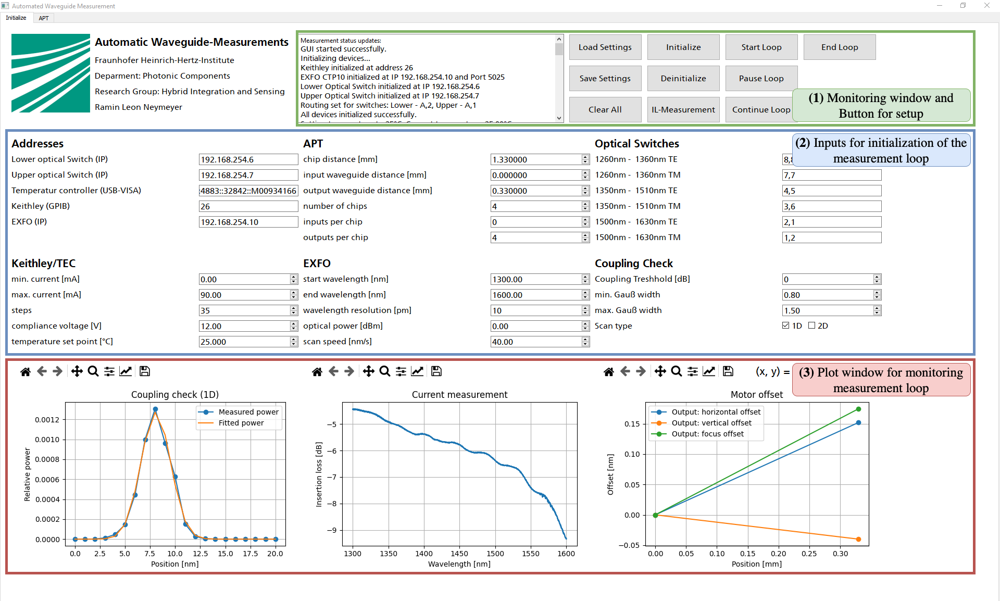

# Automated Measurement of Arrayed Waveguide Gratings

This repository contains the code for **automating a measurement setup** for the characterization of **Arrayed Waveguide Gratings (AWGs)**. The script enables automated control of measurement devices, data acquisition, and visualization of results. This project was developed as part of my **bachelor thesis**.

## Measurement Principle
The system measures the **insertion loss (IL)** of AWGs across different channels and records the spectral characteristics of the components.

## Measurement Principle
The measurement system is controlled via a Python script that communicates with connected devices using Ethernet IP and GPIB. The PyVISA library provides a standardized interface for controlling measurement instruments.

The measurement process follows a structured workflow:
1. **Device Initialization**: The script initializes all connected hardware components, including:
   - Laser Source: **EXFO**
   - Optical Switch: **Keysight**
   - Voltage Source: **Keithley**
   - Temperature Controller: **ITC4000**
   - **APT Motor Controllers and Nanotrak**

2. **Measurement Loop Execution**: The system executes a nested loop structure:
   - Set the current using the **Keithley** source
   - Wait for 60 seconds to stabilize
   - Check temperature via the **ITC4000**
   - Iterate through waveguides and adjust motor positions
   - Perform optical scans using **EXFO**
   - Verify coupling using **APT Nanotrak**
   - Store measured insertion loss (IL) data

3. **Multithreading**: Parallel execution ensures smooth operation by handling motor movements, data acquisition, and coupling checks independently. This prevents process blocking and enhances efficiency.

## GUI Overview
A graphical user interface (GUI) built with **PyQt5** facilitates user interaction:
- **Setup Controls**: Initialize and configure measurement parameters
- **Live Monitoring**: Real-time visualization of measurement data
- **Motor Control**: Adjust fiber positions via APT controllers
- **Coupling Check**: Validate optimal fiber alignment using Gaussian fitting

## Quality Control of Waveguide Facets
With the new measurement process, it is now possible to assess the **quality of waveguide facets**. By performing **2D coupling scans**, variations in the coupling efficiency can be visualized and analyzed. The generated power distribution map allows for the detection of defects or irregularities in the waveguide facets, ensuring a more precise alignment and improving overall measurement reliability.

